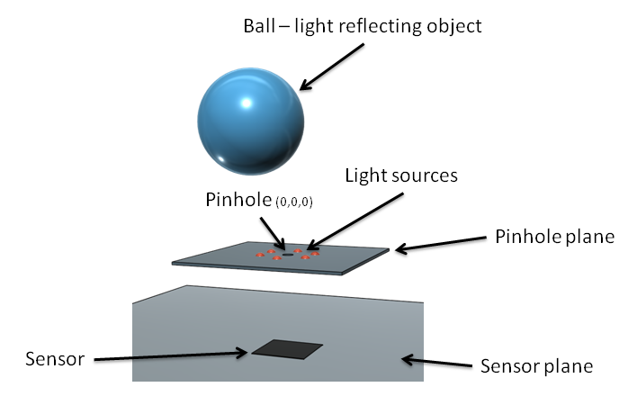
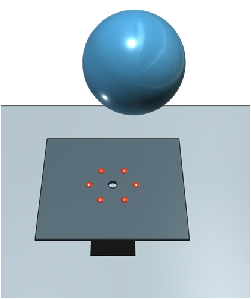
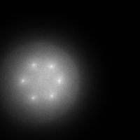
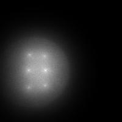
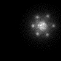

# Monte-Carlo-pinhole

The multi thread simulator of the predefined LEDs arrangement - ball - pinhole setup, written in C#. A large number of photons are emitted from each of the light sources, some reflect from the ball, go through the pinhole and meet the image plane. Simulator was utilized to estimate some dimensions for the sensor design.

## Readme overview

* Simulation environment
  * LEDs configurations
* Simulator app
  * GUI
  * Output files
* Some results
  * HighRes sensor
    * blur effect
    * ball motion tracking
  * QP sensor
    * ball motion tracking
* Dependencies
* Usage

## Simulation environment

The image below presents the simulation environment. Notice that the sensor and pinhole planes extend infinitely in the simulator but in the image they are smaller for the improved clarity.



### LEDs configurations

| Angular config  | Grid config |
| ------------- | ------------- |
| <p align="center"></p> | <p align="center"></p>  |
| <p align="center"></p>  | <p align="center"></p>  |

## Simulator app
### GUI
### Output files
## Some results
### HighRes sensor
#### Blur effect
The pinhole diameter was varied in the range of R=0.5 mm to 3.5 mm with the step of 0.1 mm.




#### ball motion tracking
### QP sensor
#### ball motion tracking
   
### Dependencies

The Spreadsheetlight library will be utilized for saving the simulation results.
```
https://www.nuget.org/packages/SpreadsheetLight/
```

## Usage

Use the Visual Studio.
