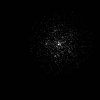

# Monte-Carlo-pinhole

The multi thread simulator of predefined LEDs arrangement - ball - pinhole setup, written in C#. A large number of photons is emitted from each of light sources, some reflect from a ball, some of which can find way to go through a pinhole and meet an image plane. Simulator was utilized to estimate some dimensions for the design of physical sensor.

## Readme overview

* Simulation environment
  * LEDs configurations
* Simulator app
  * GUI
  * Output files
  * Theory of operation
* Some results
  * HighRes sensor
    * blur effect
    * ball motion tracking
  * QP sensor
    * ball motion tracking
* Dependencies
* Usage

## Simulation environment

The image below presents the simulation environment. Notice that the sensor and pinhole planes extend infinitely in the simulator but in the image they are smaller for the improved clarity.


### LEDs configurations
The simulator allows to choose between two configurations of LEDs highlight system:
* _Angular_, which has two explicit parameters:  
  * <b>R</b> (radius - distance from the center of a pinhole and centers of photodiodes).  
  * <b>n</b> - number of photodiodes    
 Based upon the <b>n</b> angle between adjacent photodiodes is calculated (360°/n) and is displayed in the GUI of an app.
* _Grid_, which has three explicit parameters:  
  * <b>rows</b> - number of rows
  * <b>cols</b> - number of columns
  * <b>spacing</b> - straight (not diagonal) distance between adjacent photodiodes [mm]

| Angular config |   Grid config  |
|----------------|----------------|
| <p align="center"></p> | <p align="center"></p>  |
| <p align="center"></p>  | <p align="center"></p>  |

The upper row shows exemplary configurations of illumination systems (angular: n=6, R=5, grid: rows=3, cols=2, spacing=5).
The lower row presents how the high resolution sensor (mounted on the image plane) perceives the ball highlighted by each of the configurations.

## Simulator app
### GUI
### Output files
In the default setting the application saves:
* each of the images from the picturebox generated during the simulation - in the .png format
* an animation created from the images produced during the simulation - in the .gif format
* a workbook file with the values of light intensity perceived by each pixel of the sensor - in the .xlsx format  
Note that the workbook can save results from different steps of a simulation in separate worksheets.
### Theory of operation
Each of the photodiodes emits a number of photons specified by the user. For each photon the exit angles in the Spherical Coordinate system (φ, θ) are sampled. The range of drawn angles is limited in respect to the visibility of the ball by the closest photodiode (largest cone). Therefore, all of the PDs highlight the same volume so they generate the same probability density of emitted photons. The percentage of photons, which hit the obstacle is significantly higher than without this restriction, hence the overall computation process is more efficient. The same method is applied for reflected photons: the largest cone is estimated (from the point closest to the PH) and secondary photons are emitted (for the increased computation efficiency). The simplified model (Lambertian surface) was utilized so both the emission and hit efficiency (amount of energy after the event in relation to the amount of energy before the event) depend on the cosine of emission/incidence angle, regardless the type of object (plane, ball).  
The computation steps for each photon (cone calculations not mentioned here) are as follows:
*  exit angles are drawn (φ, θ); emission efficiency is calculated,
*  it is estimated wheter a photon hits the ball,
*  if positive, hit efficiency is calculated,
*  it is estimated wheter a pinhole is visible from the obtained hit point,
*  if positive, number of secondary photons exit angles are drawn; emission efficiencies are calculated,
*  it is estimated whether a secondary photon goes through the pinhole,
*  if positive, it is estimated wheater a photon hits the active surface (sensor) on the image plane,
*  if positive, hit efficiency is calculated and the total length of the path of a photon from a photodiode is measured,
*  final energy of a photon is added to a proper pixel of the sensor.
## Some results
### HighRes sensor
In this section there are presented simulation results obtained from sensor with large amount of pixels (e.g. 100x100 px).
#### Blur effect
The pinhole diameter was varied in the range of R=0.5 mm to 3.5 mm with step of 0.1 mm.




#### ball motion tracking
### QP sensor
The QP abbreviation stands for Quadrant Photodiode. It means that the simulated sensor consists of only four pixels. In this case the image from the picturebox is less meaningful and the scatter plot should be observed. Based on the proportions of illumination level between each of the pixels a position of the light reflecting object can be roughly estimated.
#### ball motion tracking
   
### Dependencies

The Spreadsheetlight library will be utilized for saving the simulation results.
```
https://www.nuget.org/packages/SpreadsheetLight/
```

## Usage

Use the Visual Studio.
